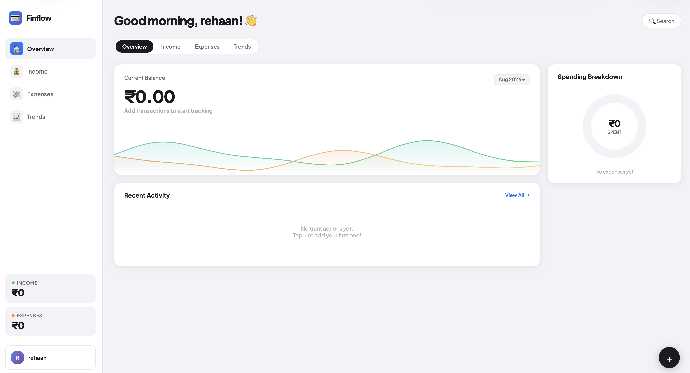

# 💳 Finflow — Budget Tracker

A clean, responsive personal budget tracker built with vanilla HTML, CSS, and JavaScript. Track income and expenses, visualize spending by category, and monitor trends — all stored locally in your browser. No frameworks, no backend, no build step.




---

## ✨ Features

- **Overview dashboard** — current balance, a smooth animated trend wave, and recent activity at a glance
- **Income & Expenses tracking** — add, view, and delete transactions with category tagging
- **Category filters** — quickly filter expenses by category
- **Spending breakdown donut chart** — visual split of expenses by category
- **Trends page** — total income, total expenses, net saved, average transaction size, and a per-category bar breakdown
- **Live search** — instantly search across all transactions by description, category, amount, or date
- **Personalized greeting** — set your name once, greeted based on time of day
- **Fully responsive** — dedicated layouts for desktop, tablet, and mobile, including a native-style bottom navigation bar on mobile
- **Persistent storage** — all data is saved to `localStorage`, so it survives page reloads with zero setup

---

## 🖥️ Tech Stack

- **HTML5** — semantic structure (`index.html`)
- **CSS3** — custom properties, flexbox/grid, responsive media queries (`styles.css`)
- **Vanilla JavaScript (ES6+)** — no dependencies, no frameworks (`script.js`)
- **Canvas API** — for the animated balance trend chart
- **SVG** — for the spending breakdown donut chart

---

## 📂 Project Structure

```
finflow/
├── index.html      # Markup and page structure
├── styles.css       # All styling, including responsive breakpoints
├── script.js         # App logic, state management, and rendering
└── README.md         # This file
```

---

## 🚀 Getting Started

No installation or build process required.

1. Clone the repo:
   ```bash
   git clone https://github.com/your-username/finflow.git
   cd finflow
   ```
2. Open `index.html` in your browser — that's it.

   Optionally, serve it locally for a smoother experience (e.g. avoids some browser file:// restrictions):
   ```bash
   npx serve .
   # or
   python3 -m http.server 8000
   ```

> **Note:** Keep `index.html`, `styles.css`, and `script.js` in the same folder — the HTML references the other two via relative paths.

---

## 📱 Responsive Behavior

| Breakpoint | Layout |
|---|---|
| **Desktop** (≥1025px) | Full sidebar navigation, two-column overview |
| **Tablet** (769px–1024px) | Condensed sidebar, adjusted spacing |
| **Mobile** (≤768px) | Sidebar hidden, bottom tab bar navigation, single-column stacked layout |

---

## 💾 Data & Privacy

All transaction data and your saved name are stored **entirely in your browser's `localStorage`**. Nothing is sent to a server — your financial data never leaves your device.

---

## 🗺️ Roadmap Ideas

- [ ] Export/import data as CSV or JSON
- [ ] Recurring transactions & bill reminders
- [ ] Multi-currency support
- [ ] Dark mode
- [ ] Custom category creation

---

## 🤝 Contributing

Contributions, issues, and feature requests are welcome. Feel free to open a pull request or file an issue.

